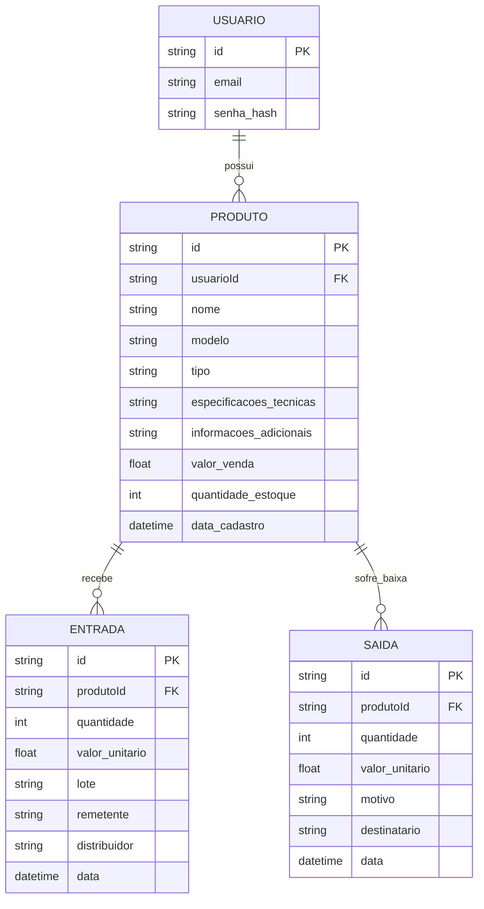

# 🛠️ Especificação Técnica (Tech Spec) - PC-Stock

Este documento detalha a arquitetura técnica, o modelo de dados e os contratos de API (via JSON Server) necessários para o funcionamento do sistema de gerenceamento do PC-Stock.

## 1. Modelo de Dados (Diagrama ER)

Abaixo está o Diagrama Entidade-Relacionamento (DER) que representa a estrutura do nosso "banco de dados" (`db.json`) e como as informações se conectam.



## 2. Dicionário de Dados

Breve explicação das tabelas principais:

- **Usuario:** Responsável por armazenar os dados de autenticação.
  - id: Identificador único gerado pelo JSON Server (String ou Hash).
  - email: Chave de acesso do usuário. Em um cenário real seria único, mas para o MVP não há trava estrita no banco, apenas validação no front-end.
  - senha: Chave de acesso que autentica com o email para confirmar ja esta cadastrado no banco de dados.
- **Produto:** Registra um produto e fica vinculado com um cliente, com suas informaçoes.
  - id: Identificador único gerado pelo JSON Server (String ou Hash).
  - usuarioId: Chave estrangeira que vincula a produto ao  usuario (padrão de nomenclatura exigido pelo JSON Server para rotas aninhadas).
  - nome
  - modelo
  - tipo
  - especificacoes_tecnicas
  - informacoes_adicionais
  - valor_venda
  - quantidade_estoque
  - data_cadastro
}
## 3. Rotas da API (JSON Server)

A aplicação consome a API local simulada pelo JSON Server. Abaixo os principais endpoints:

- `GET /usuarios` - Retorna a lista de usuários.
- `POST /usuarios` - Cadastra um novo usuário.
- `GET /transacoes?id_usuario=1` - Retorna o extrato de um usuário específico.

## 4. Estrutura do Banco de Dados (db.json)

Esta é a representação em formato JSON do banco de dados simulado. Esta estrutura serve de contexto para ferramentas de IA e para o JSON Server inicializar a API Fake.

```JSON
{
  "usuarios": [
    {
      "id": 1,
      "email": "cliente@email.com",
      "senha_hash": "hash_da_senha"
    }
  ],
  "produtos": [
    {
      "id": 1,
      "usuarioId": 1,
      "nome": "Placa de Vídeo",
      "modelo": "RX 5600 XT",
      "tipo": "Hardware",
      "especificacoes_tecnicas": "6GB GDDR6, 192-bit",
      "informacoes_adicionais": "Marca Sapphire",
      "valor_venda": 1800.00,
      "quantidade_estoque": 10,
      "data_cadastro": "2026-03-24"
    }
  ],
  "entradas": [
    {
      "id": 1,
      "produtoId": 1,
      "quantidade": 10,
      "valor_unitario": 1200.00,
      "lote": "Lote-2026-03-A",
      "remetente": "Fornecedor XYZ",
      "distribuidor": "Distribuidora ABC",
      "data": "2026-03-24"
    }
  ],
  "saidas": [
    {
      "id": 1,
      "produtoId": 1,
      "quantidade": 2,
      "valor_unitario": 1800.00,
      "motivo": "VENDA",
      "destinatario": "Mercado Livre",
      "data": "2026-03-25"
    },
    {
      "id": 2,
      "produtoId": 1,
      "quantidade": 1,
      "valor_unitario": null,
      "motivo": "DEFEITO",
      "destinatario": null,
      "data": "2026-03-25"
    }
  ]
}
...
