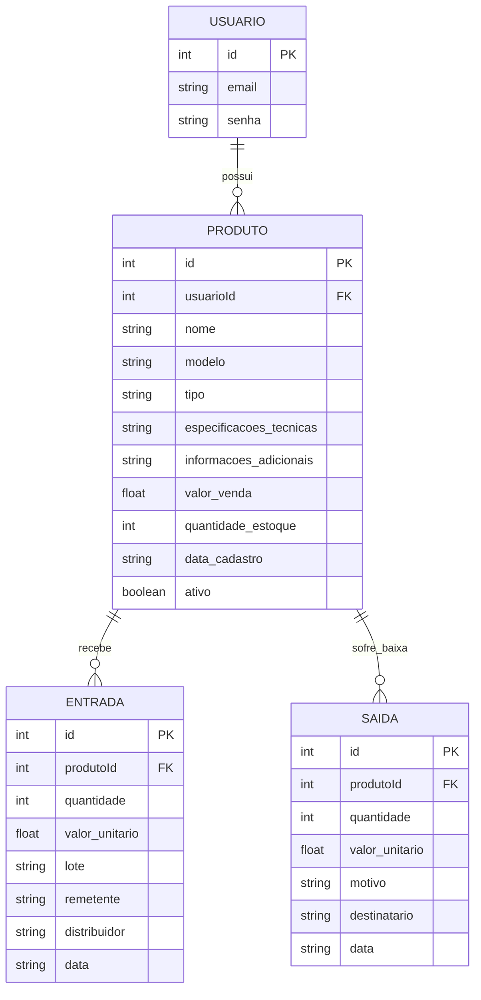

# 🛠️ Especificação Técnica (Tech Spec) - PC-Stock

Este documento detalha a arquitetura técnica, o modelo de dados e os contratos de API (via JSON Server) necessários para o funcionamento do sistema de gerenceamento do PC-Stock.

## 1. Modelo de Dados (Diagrama ER)

Abaixo está o Diagrama Entidade-Relacionamento (DER) que representa a estrutura do nosso "banco de dados" (`db.json`) e como as informações se conectam.

## 1. Modelo de Dados (Diagrama ER)

Abaixo está o Diagrama Entidade-Relacionamento (DER) que representa a estrutura atual do nosso "banco de dados" (`db.json`) e como as informações se conectam dentro do sistema.



## 2. Dicionário de Dados

Breve explicação das tabelas principais:

- **Usuario:** Responsável por armazenar os dados de autenticação.
  - id: Identificador único gerado pelo JSON Server (String ou Hash).
  - email: Chave de acesso do usuário. Em um cenário real seria único, mas para o MVP não há trava estrita no banco, apenas validação no front-end.
  - senha: Chave de acesso que autentica com o email para confirmar ja esta cadastrado no banco de dados.
- **Produto:** Registra um produto e fica vinculado com um cliente, com suas informaçoes.
  - id: Identificador único do produto.
  - usuarioId: Chave estrangeira que vincula o produto a um usuário específico, garantindo que cada estoque seja individual.
  - nome: Nome principal do produto, utilizado para identificação rápida.
  - modelo: Modelo ou versão do produto, permitindo diferenciação entre itens semelhantes.
  - tipo: Categoria do produto (ex: Hardware, Periférico). Campo opcional utilizado para organização.
  - especificacoes_tecnicas: Informações detalhadas sobre características técnicas do produto (ex: memória, velocidade, compatibilidade). Campo opcional.
  - informacoes_adicionais: Campo livre para observações extras, como estado do produto ou notas internas.
  - valor_venda: Valor unitário de venda do produto, utilizado como base para operações comerciais.
  - quantidade_estoque: Quantidade atual disponível no estoque. Esse valor é dinâmico e deve ser atualizado a cada movimentação (entrada ou saída).
  - data_cadastro: Data em que o produto foi registrado no sistema.
- **Entradas:** Responsável por registrar todas as movimentações de entrada de produtos no estoque, normalmente associadas a compras, reposições ou recebimento de mercadorias.
  - id: Identificador único da entrada.
  - produtoId: Chave estrangeira que vincula a entrada a um produto previamente cadastrado.
  - quantidade: Quantidade de itens adicionados ao estoque nessa operação.
  - valor_unitario: Custo unitário do produto no momento da entrada, importante para controle financeiro e cálculo de margem.
  - lote: Identificação do lote de origem da mercadoria, útil para rastreabilidade e controle logístico.
  - remetente: Origem do envio (ex: fornecedor específico ou local de envio). Campo opcional.
  - distribuidor: Empresa ou entidade responsável pela distribuição do produto.
  - data: Data em que a entrada foi realizada.
-**Saida:** Responsável por registrar todas as movimentações de saída de produtos do estoque, incluindo vendas, perdas, defeitos ou ajustes de inventário.
  - id: Identificador único da saída.
  - produtoId: Chave estrangeira que vincula a saída a um produto existente.
  - quantidade: Quantidade de itens removidos do estoque.
  - valor_unitario: Valor unitário do produto no momento da saída. Utilizado principalmente em casos de venda para controle financeiro.
  - motivo: Define a natureza da saída. Exemplos comuns incluem "VENDA", "DEFEITO", "AJUSTE", entre outros.
  - destinatario: Indica para onde o produto foi destinado (ex: plataformas de venda como Mercado Livre, Amazon ou loja física). Pode ser nulo dependendo do tipo de saída.
  - data: Data em que a saída foi registrada.
## 3. Rotas da API (JSON Server)

A aplicação consome a API local simulada pelo JSON Server. Abaixo os principais endpoints:

### Usuários
- `GET /usuarios` - Retorna a lista de usuários.
- `POST /usuarios` - Cadastra um novo usuário.

### Produtos
- `GET /produtos` - Retorna a lista de produtos.
- `GET /produtos?usuarioId=1` - Retorna os produtos de um usuário específico.
- `POST /produtos` - Cadastra um novo produto.
- `PATCH /produtos/:id` - Atualiza parcialmente um produto, como quantidade em estoque ou status ativo.
- `DELETE /produtos/:id` - Remove um produto, quando aplicável pela regra de negócio.

### Entradas
- `GET /entradas` - Retorna a lista de entradas.
- `GET /entradas?produtoId=1` - Retorna as entradas de um produto específico.
- `POST /entradas` - Registra uma nova entrada de estoque.

### Saídas
- `GET /saidas` - Retorna a lista de saídas.
- `GET /saidas?produtoId=1` - Retorna as saídas de um produto específico.
- `POST /saidas` - Registra uma nova saída de estoque.
  
## 4. Estrutura do Banco de Dados (db.json)

Esta é a representação em formato JSON do banco de dados simulado. Esta estrutura serve de contexto para ferramentas de IA e para o JSON Server inicializar a API Fake.

```JSON
{
  "usuarios": [
    {
      "id": 1,
      "email": "cliente@email.com",
      "senha": "123456"
    }
  ],
  "produtos": [
    {
      "id": 1,
      "usuarioId": 1,
      "nome": "Placa de Vídeo",
      "modelo": "RX 5600 XT",
      "tipo": "Hardware",
      "especificacoes_tecnicas": "6GB GDDR6, 192-bit",
      "informacoes_adicionais": "Marca Sapphire",
      "valor_venda": 1800.00,
      "quantidade_estoque": 7,
      "data_cadastro": "2026-03-24",
      "ativo": true
    },
    {
      "id": 2,
      "usuarioId": 1,
      "nome": "Processador",
      "modelo": "Ryzen 5 5600",
      "tipo": "Hardware",
      "especificacoes_tecnicas": "6 núcleos, 12 threads, 4.4GHz",
      "informacoes_adicionais": "Socket AM4",
      "valor_venda": 950.00,
      "quantidade_estoque": 0,
      "data_cadastro": "2026-04-01",
      "ativo": true
    }
  ],
  "entradas": [
    {
      "id": 1,
      "produtoId": 1,
      "quantidade": 10,
      "valor_unitario": 1200.00,
      "lote": "Lote-2026-03-A",
      "remetente": "Fornecedor XYZ",
      "distribuidor": "Distribuidora ABC",
      "data": "2026-03-24"
    }
  ],
  "saidas": [
    {
      "id": 1,
      "produtoId": 1,
      "quantidade": 2,
      "valor_unitario": 1800.00,
      "motivo": "VENDA",
      "destinatario": "Mercado Livre",
      "data": "2026-03-25"
    },
    {
      "id": 2,
      "produtoId": 1,
      "quantidade": 1,
      "valor_unitario": null,
      "motivo": "DEFEITO",
      "destinatario": null,
      "data": "2026-03-25"
    }
  ]
}
````

## 5. Framework CSS

O projeto PC-Stock utiliza o **Bootstrap v5.3.8** como framework CSS oficial da aplicação.

### Importância da Verção

O registro exato da versão utilizada é importante para garantir compatibilidade futura durante a manutenção do projeto, evitando diferenças de comportamento entre classes, componentes e utilitários do framework. Essa definição também ajuda ferramentas de Inteligência Artificial, como Cursor e Copilot, a gerar código utilizando a sintaxe e os componentes corretos da versão realmente adotada no sistema.
